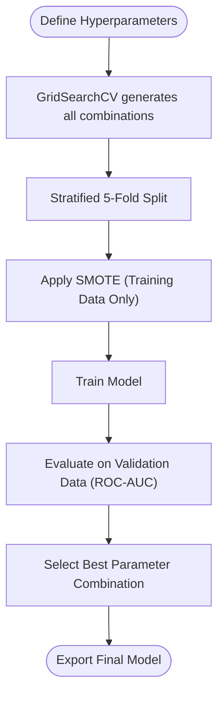

# Loan Approval Prediction

A comparative study of classification algorithms for loan approval prediction.
Built as part of the Machine Learning course at BINUS University (2025/2026).

**Team:**
Aulia Aca Azzahra · Juan Jonathan Suparmo · Samuel Rafin Djunaidi · Vincent Vic Chow

---

## Project Structure

```
Loan Approval/
├── data/
│   └── loan_data.csv                  # Kaggle dataset
├── models/                            # Exported model pipelines (.pkl)
│   └── model_info.json                # Metrics + best model flag
├── charts/                            # Saved charts for presentations
├── static/                            # Frontend assets (CSS, JS)
├── templates/
│   └── index.html                     # Web interface
├── loan_approval.v1.ipynb             # Notebook — basic pipeline
├── loan_approval.v2.ipynb             # Notebook — full pipeline + charts
├── generate_notebook.v1.py            # Script that generates v1 notebook
├── generate_notebook.v2.py            # Script that generates v2 notebook
├── app.py                             # Flask web app (backend + frontend)
├── project_report.md                  # Research methodology report
└── requirements.txt                   # Python dependencies
```

### v1 vs v2 Notebooks

| | v1 | v2 |
|---|---|---|
| EDA | Basic distributions | Full distributions + outlier boxplots + scatter plots |
| Charts | Displayed only | Saved to `charts/` for presentations |
| Models tuned | Random Forest only | Random Forest + SVM + KNN |
| Model export | Best model only (`best_model_pipeline.pkl`) | All models to `models/` + `model_info.json` |
| Web app | Not connected | Connected — Flask loads all models from `models/` |

Use **v2** for the final submission. v1 exists as a simpler reference.

---

## How to Run

### Prerequisites

- Python 3.10+
- pip

### 1. Install dependencies

```bash
pip install -r requirements.txt
```

### 2. Run the notebook

Open `loan_approval.v2.ipynb` in VS Code or Jupyter and **Run All** cells.

This will:
- Run the full EDA and generate charts in `charts/`
- Train all 5 classifiers + tune RF, SVM, and KNN
- Export all model pipelines to `models/`
- Write `models/model_info.json` with evaluation metrics

> **Note:** The first run takes a few minutes due to SVM training and GridSearchCV.
> After running, you should see `.pkl` files inside `models/`.

### 3. Start the web app

```bash
python app.py
```

Then open [http://127.0.0.1:5000](http://127.0.0.1:5000) in your browser.

The web interface lets you:
- Fill in a loan application form
- Select which model to use (dropdown at the top, defaults to the best one)
- See the prediction result with an approval probability gauge

---

## Pipeline Overview

```
Raw CSV ──> EDA ──> Preprocessing ──> SMOTE ──> Model Training ──> Evaluation ──> Export
```

### Step 1 — Exploratory Data Analysis

- Class distribution check (approved vs rejected)
- Numerical feature histograms (age, income, loan amount, interest rate, etc.)
- Outlier detection via boxplots (extreme values in `person_age` and `person_income`)
- Correlation heatmap to identify feature relationships
- Categorical feature breakdown by loan status

### Step 2 — Preprocessing (`ColumnTransformer`)

All transformations happen inside a single Scikit-Learn pipeline to prevent
data leakage during cross-validation.

| Feature type | Transformation |
|---|---|
| Numerical (8 features) | Median imputation → StandardScaler |
| Ordinal (`person_education`) | Mode imputation → OrdinalEncoder (High School < Associate < Bachelor < Master < Doctorate) |
| Nominal (4 features) | Mode imputation → OneHotEncoder (drop first) |

### Step 3 — Class Imbalance Handling (SMOTE)

The dataset has an uneven class distribution. SMOTE generates synthetic
minority-class samples during training only (never on test data). This is
handled by using `imblearn.pipeline.Pipeline` instead of the standard
sklearn pipeline.

The notebooks include a direct comparison of Logistic Regression with and
without SMOTE to demonstrate the recall improvement.

### Step 4 — Model Training & Comparison

Five classifiers from the proposal, all trained with SMOTE:

| Model | Accuracy | F1 | ROC-AUC |
|---|---|---|---|
| Logistic Regression | 86.22% | 74.61% | 95.62% |
| Decision Tree | 88.92% | 76.42% | 86.02% |
| Random Forest | 91.99% | 82.10% | 97.30% |
| SVM | 88.24% | 77.61% | 96.16% |
| KNN | 84.53% | 71.20% | 91.53% |

### Step 5 — Hyperparameter Tuning (GridSearchCV + Stratified 5-Fold CV)

To ensure maximum performance without overfitting, the complex models underwent rigorous hyperparameter tuning using Scikit-Learn's `GridSearchCV`.



1. **Defining the Hyperparameter Grid:** We supplied a dictionary of potential parameters. For example, for the Random Forest, we provided `n_estimators` (100, 200), `max_depth` (None, 10, 20), and `min_samples_split` (2, 5).
2. **Exhaustive Combinatorial Search:** `GridSearchCV` calculates every possible mathematical combination and trains a new model from scratch for *every single combination*.
3. **Stratified 5-Fold Evaluation:** Every parameter combination was tested 5 separate times on 5 different chunks of the dataset. "Stratified" ensures every validation fold maintained the exact 78/22 class ratio of the original dataset.
4. **Scoring Metric:** The Grid Search evaluated success using the **ROC-AUC** metric (rather than basic accuracy) to properly penalize the model for false positives and false negatives under class imbalance.

The optimal combinations discovered were:

| Model | Parameters Tuned & Optimized | Best Test ROC-AUC |
|---|---|---|
| Random Forest | `n_estimators`, `max_depth`, `min_samples_split` | **97.36%** |
| SVM | `C`, `kernel` | 96.16% |
| KNN | `n_neighbors`, `weights` | 93.74% |

### Step 6 — Export & Deployment

All pipelines (including preprocessing + model) are saved as `.pkl` files.
The Flask app loads them at startup and exposes:
- `GET /` — Web interface
- `GET /api/models` — Available models with their metrics
- `POST /predict` — Accepts a JSON loan application, returns prediction + probability

### Step 7 — Known Data Anomalies & Limitations (For Real-World Deployment)

During development, critical data characteristics were identified:
- **Categorical Heatmap Exclusion:** Standard Pandas correlation (`df.corr()`) dropped `previous_loan_defaults_on_file` because it is a text field. However, categorical analysis proved it is the strongest predictor in the dataset.
- **Perfect Default Rejection:** 100% of applicants with a previous default were rejected in the dataset. The models treat this as a dominant "hard rule".
- **OOD Vulnerability:** Because extreme outliers were removed to improve accuracy, the model is blind to "Out-Of-Distribution" inputs (e.g., $1M loan with $100 income). 
- **Solution:** In real-world FinTech deployments, this ML pipeline must be placed behind a **Business Logic Engine** (hard-coded rules like `if loan > income * 3: reject`) to intercept impossible numbers before the AI attempts to process them.

### Step 8 — Feature Ablation Experiment (Optimization)

A feature ablation experiment was conducted on the Tuned Random Forest model to test the predictive value of individual features. The results confirmed statistical noise and drove our final deployment recommendation:

| Experiment | ROC-AUC | Training Time | Insight |
|---|---|---|---|
| **Baseline (All 13 Features)** | 0.9735 | ~8.00s | The benchmark score. |
| **Dropped `person_gender`** | **0.9744** | **~7.10s** | **Accuracy Improved.** Gender acted as statistical noise. Dropping it made the model faster and fairer. |
| **Dropped `person_gender` + `loan_intent`** | 0.9696 | ~6.50s | Accuracy dropped. `loan_intent` carries strong predictive signal. |
| **Dropped `previous_loan_defaults_on_file`** | 0.9232 | ~8.40s | Massive accuracy drop. Confirms the model's heavy reliance on this single dominant feature. |

**Final Conclusion:** For production deployment, we strictly recommend **permanently dropping the `person_gender` feature**. Mathematically, it improves predictive accuracy and reduces training/inference time. Ethically, it guarantees the algorithm is 100% compliant with anti-discrimination financial laws (e.g., ECOA), completely eliminating the risk of gender bias.

---

## Charts (for Presentations)

After running the v2 notebook, the `charts/` folder contains:

| File | Description |
|---|---|
| `target_distribution.png` | Approved vs rejected class counts |
| `feature_distributions.png` | Histograms of all 8 numerical features |
| `outlier_boxplots.png` | Boxplots for outlier detection |
| `correlation_heatmap.png` | Lower-triangle correlation matrix |
| `categorical_distributions.png` | Categorical features by loan status |
| `income_vs_loan.png` | Scatter: income vs loan amount by status |
| `model_comparison.png` | Grouped bar chart of all metrics |
| `confusion_matrices.png` | Heatmap grid for each model |
| `roc_curves.png` | Overlaid ROC curves |
| `feature_importance.png` | Random Forest feature importances |
| `ablation_time_results.png` | Side-by-side bar charts showing ROC-AUC vs Training Time from the ablation experiment |

---

## References

- Brown, I., & Mues, C. (2012). An experimental comparison of classification algorithms for imbalanced credit scoring data sets. *Expert Systems with Applications*, 39(3), 3446–3453.
- Lessmann, S., Baesens, B., Seow, H. V., & Thomas, L. C. (2015). Benchmarking state-of-the-art classification algorithms for credit scoring. *European Journal of Operational Research*, 247(1), 124–136.
- Taweilo. (n.d.). Loan approval classification data. Kaggle. https://www.kaggle.com/datasets/taweilo/loan-approval-classification-data
